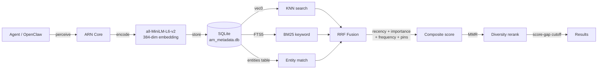

# ARN — Adaptive Reasoning Network

> **Beta v0.10.0** — active development branch. Previous stable code is on `beta-v9`.

Persistent memory for AI agents that runs on a Raspberry Pi.

---

## The Problem

Every time a conversation ends, the agent forgets everything. I got tired of re-explaining my setup, preferences, and what we were working on at the start of every session. Existing solutions either require a cloud service, charge per API call, or implement memory as a flat list of strings that gets searched with cosine similarity alone — which reliably fails for exact terms, version numbers, and proper nouns.

ARN stores memories locally in a single SQLite file and retrieves them using three signals at once: vector similarity, full-text keyword search, and entity matching. All three are fused before ranking. The result is a system that can recall "that Redis timeout issue from two weeks ago" as well as "what framework the user prefers."

---

## How It Works



### Retrieval pipeline

Every `recall()` call:

1. **Vector KNN** — top-K nearest neighbors via `sqlite-vec` (approximate, indexed)
2. **FTS5** — BM25 keyword search with Porter stemming. Catches exact terms that get compressed in the vector space.
3. **Entity matching** — extracts proper nouns, code identifiers, file paths, and numbers+units from the query. Boosts results that share named entities.
4. **Reciprocal Rank Fusion** — fuses all three ranked lists without hand-tuning weights. An episode ranked #1 in all three lists gets the maximum possible RRF score.
5. **Composite score** — `rrf + recency×0.3 + importance×0.15 + log(1+access_count)×0.05 + pin_boost`
6. **MMR reranking** — Maximal Marginal Relevance eliminates near-duplicate results so diverse information surfaces
7. **Score-gap cutoff** — instead of a fixed threshold, finds the largest relative gap in the score distribution and cuts there. Adapts to each query.

### Why SQLite over a vector DB

Everything lives in one file. No separate vector store, no sync issues, no process to manage. `sqlite-vec` adds indexed KNN via a virtual table — it's C, not Python, so it's fast enough. The single-file constraint matters for Raspberry Pi deployments where I don't want another process eating RAM.

### Why RRF over single-signal retrieval

Cosine similarity alone misses exact terms ("JWT", "Redis", `v2.3.1`). BM25 alone misses paraphrases. Neither handles proper nouns well. RRF combines all three without requiring me to tune weights across query types — it just works by averaging rank positions.

### Why adaptive thresholds over fixed

A fixed threshold of 0.3 cuts relevant results for niche topics (where even the best match has moderate similarity) and includes noise for general queries (where results drop off a cliff after rank 2). The gap method adapts: it looks at each query's own score distribution and cuts at the largest relative drop.

### Why procedural memory

Other systems (Hermes, MemGPT) store individual facts and events. ARN also synthesizes *procedures* — "here's how to debug this type of problem" — after sessions complex enough to be worth remembering. A session that involved 4+ tool calls, multiple tools, and at least one error correction gets synthesized into a GOAL/STEPS/FAILURES/VERIFICATION memory with `role='procedural'` and `importance=0.85`. It surfaces through the same retrieval pipeline, auto-injected before the next relevant session.

This was inspired by studying how Hermes handles SKILL.md files — but Hermes requires the agent to decide when to write a skill. ARN extracts them automatically, without the agent's involvement.

---

## Architecture

```
arn_v9/
├── core/
│   ├── cognitive.py      # ARNv9 class — perceive, recall, reflect, deep_reflect
│   ├── embeddings.py     # EmbeddingEngine (all-MiniLM-L6-v2 or custom fn)
│   ├── retrieval.py      # fuse_rrf, recency_score, mmr_rerank, score_gap_cutoff
│   ├── entities.py       # extract_entities (proper nouns, code, URLs, numbers)
│   ├── reflect.py        # scan_contradictions, recalibrate_importance, detect_ambiguity
│   └── procedural.py     # compute_task_complexity, extract_procedure, deep_reflect_procedures
├── storage/
│   └── persistence.py    # SQLite + sqlite-vec + FTS5, schema v7, all storage ops
├── api/
│   └── server.py         # FastAPI REST server + plugin endpoints (port 7900) + daemon
└── scripts/
    └── arn_cli.py        # arn CLI
```

Schema v7 tables: `episodes` · `episode_embeddings` (vec0) · `episodes_fts` (FTS5) · `entities` · `sessions` · `semantic_nodes` · `memory_review_queue` · `memory_links` · `system_state` · `schema_version`

---

## Quick Start

**Prerequisites:** Python 3.10+, Mac or Linux (including Raspberry Pi)

```bash
git clone https://github.com/tuuhe99-del/ARN-Adaptive-Reasoning-Network.git
cd ARN-Adaptive-Reasoning-Network
./install.sh
```

Store and recall:

```bash
arn server --daemon
arn store -c "User prefers Python for scripting" -i 0.8
arn recall -q "what language does the user code in?"
# → returns the Python fact even though "language" and "code" weren't in the stored text
```

Python API:

```python
from arn_v9.core.cognitive import ARNv9

arn = ARNv9(data_dir="./memory")
arn.perceive("Deployed on Raspberry Pi 5 with 8GB RAM", importance=0.7)

results = arn.recall("what hardware does the user run?", top_k=3)
for r in results:
    print(r['content'], r['score'])

arn.pin(results[0]['id'])   # survives consolidation + decay
stats = arn.reflect()       # post-session analysis
arn.close()
```

---

## OpenClaw Integration

```bash
arn server --daemon --port 7900
arn connect
```

`arn connect` installs the TypeScript plugin from `integrations/openclaw/`, wires it into OpenClaw, and disables OpenClaw's built-in markdown memory. After that:

- Memories are auto-injected before every LLM call via `before_prompt_build` (priority 40)
- All messages, tool calls, and outputs are captured automatically
- Post-session reflection runs when the conversation ends
- The agent gets 5 tools: `arn_recall`, `arn_pin`, `arn_forget`, `arn_sessions`, `arn_review`

```bash
arn disconnect   # restore OpenClaw's built-in memory (ARN data preserved)
arn status       # daemon status + episode/session counts
```

---

## Session and Role Tracking

Every memory is tagged with `role` (user / assistant / tool_call / tool_result / procedural / user_identity) and linked to a `session_id`. This enables filtering and post-session analysis.

```python
storage = arn.storage
storage.create_session("sess-001", reason_start="user opened chat")

vec = arn.embedder.encode("What's the Redis timeout setting?")
storage.store_episode(
    content="What's the Redis timeout setting?",
    vector=vec,
    role="user",
    session_id="sess-001",
)

storage.end_session("sess-001", reason_end="user closed chat")
stats = arn.reflect(session_id="sess-001")
# → also extracts a procedure if session complexity >= 8.0
```

---

## Post-Session Reflection

```bash
arn reflect
arn review
arn resolve <id> keep_both   # or: update / delete / pin / defer
```

`reflect()` runs three analysis passes:
1. **Contradiction scan** — pairs with sim > 0.85 + word overlap < 40% go to review queue
2. **Importance recalibration** — episodes accessed 5+ times get a proportional importance boost
3. **Procedure extraction** — sessions with complexity ≥ 8.0 synthesize a `role='procedural'` memory

`deep_reflect()` adds periodic curation:
- Stale detection: zero-access procedures older than 30 days → importance = 0.1
- Duplicate merging: sim > 0.9 procedure pairs → keep higher effectiveness, supersede other
- Archival: importance < 0.15 + age > 60 days → set `valid_until` (archived, not deleted)

---

## Procedural Memory

A session that debugged an import error by searching the web, installing a missing package, and re-running the script gets synthesized into:

```
GOAL: Fix the import error in my Python script

STEPS:
  1. web_search(python install requests module)
  2. exec(pip install requests)
  3. exec(python3 script.py)

FAILURES:
  - Tried: exec(python3 script.py)
    Result: ImportError: No module named requests

VERIFICATION: Script ran successfully. Output: OK

CONTEXT: Python
```

This surfaces the next time a similar problem comes up — automatically, without the agent asking for it. Procedures self-improve: when a session matches an existing procedure and finds a better approach, the old procedure is archived and the new one takes over. `arn.restore_procedure(id)` reverses any supersession.

Effectiveness is tracked: after each session, procedures that were injected and associated with a low-error session get a +0.1 boost; procedures that precede a high-error session get a -0.2 reduction. Procedures that drop below 0.3 effectiveness are flagged in the review queue.

---

## CLI Reference

```bash
# Memory operations
arn store -c "..." -i 0.8            # store a memory (importance 0–1)
arn recall -q "..."                  # retrieve by meaning
arn context -q "..."                 # formatted block for prompt injection
arn forget <id>                      # soft-delete
arn pin <id>                         # pin (survives decay + consolidation)
arn unpin <id>                       # unpin
arn history <id>                     # supersession chain

# Post-session workflow
arn reflect                          # reflection + review queue
arn review                           # list pending items
arn resolve <id> <action>            # update / delete / pin / keep_both / defer
arn consolidate                      # explicit consolidation

# Data
arn stats                            # episode counts, queue depth
arn export                           # export to JSON
arn import                           # import from JSON

# Server
arn server                           # start HTTP server (foreground)
arn server --daemon --port 7900      # background daemon
arn server --stop                    # stop daemon
arn status                           # daemon status + stats

# OpenClaw
arn connect                          # install plugin, start daemon
arn disconnect                       # remove plugin, restore built-in memory
```

---

## Plugin API (port 7900)

No auth required. No `agent_id` — uses `ARN_AGENT_ID` env var (default: `"default"`).

| Method | Path | What it does |
|--------|------|--------------|
| `POST` | `/perceive` | Store with role + session context |
| `POST` | `/recall` | Recall with optional role_filter |
| `POST` | `/session/start` | Start session record |
| `POST` | `/session/end` | End session, trigger reflect() |
| `GET` | `/sessions/recent` | List recent sessions |
| `GET` | `/session/{id}` | Session detail |
| `POST` | `/pin` / `/unpin` | Pin management |
| `POST` | `/forget` | Soft-delete |
| `GET` | `/reviews/pending` | Review queue |
| `POST` | `/reviews/resolve` | Resolve review item |
| `GET` | `/v1/health` | Health + episode/session counts |

---

## Tests

```
59 passed, 3 skipped
```

3 skipped tests require the real embedding model (`all-MiniLM-L6-v2`) — they test semantic quality and are skipped in offline environments automatically.

```bash
python -m pytest tests/ -v
```

See `docs/test-results.md` for full breakdown by test class.

---

## Configuration

| Variable | Default | What it does |
|----------|---------|--------------|
| `ARN_DATA_DIR` | `~/.arn_data` | Database location |
| `ARN_AGENT_ID` | `default` | Default agent ID |
| `ARN_API_KEY` | *(none)* | If set, write endpoints require `X-Api-Key` |
| `ARN_RATE_LIMIT_RPS` | `60` | Max requests/second per IP |
| `ARN_DECAY_INTERVAL_SECONDS` | `3600` | How often recency decay runs |

One file per agent: `~/.arn_data/{agent_id}/arn_metadata.db`

---

## Design Decisions

**Why no auto-consolidation?** The old system ran clustering mid-session at 256 episodes. It could corrupt memories that were still being actively referenced. Consolidation is now explicit: call `arn consolidate` when you want it.

**Why supersedes chains instead of destructive updates?** Because the old version is often correct. The user says "I switched from Redis to Postgres" — but maybe they switch back next month. Soft invalidation with `valid_until` keeps history; `arn.get_history(id)` walks the full chain.

**Why working memory as a 7-slot ring buffer?** Inspired by Miller's law (cognitive science). It keeps the current session's context always available at the top of recall results without needing to re-query it. The slots decay over time, not by count.

**Why procedural memory extraction vs. manual SKILL.md files?** Manual skill creation requires the agent to decide when a skill is worth capturing. Complexity scoring + automatic extraction after sufficiently complex sessions captures hard-won knowledge without agent overhead. The GOAL/STEPS/FAILURES structure is built from the actual tool call sequence — no summarization, no LLM cost.

---

## Known Limitations

- **No inter-agent memory sharing** — each `agent_id` is isolated. Sharing knowledge between agents requires a sync layer.
- **Contradiction detection is heuristic** — cosine similarity > 0.85 + word overlap < 40% isn't NLI. It fires false positives on paraphrases. An NLI cross-encoder would fix this (see CONTRIBUTING.md).
- **Text only** — no images, audio, or structured data.
- **English-tuned by default** — `all-MiniLM-L6-v2` is English-optimized. Pass `embedding_fn` for multilingual support.
- **workers=1 recommended** — sentence-transformers loads ~500MB of PyTorch per process. Scale horizontally, not vertically.

---

## License

**PolyForm Small Business 1.0.0** — see [LICENSE.md](./LICENSE.md) and [COMMERCIAL.md](./COMMERCIAL.md).

Free if you're an individual, researcher, hobbyist, or at a company with fewer than 100 people and under $1M revenue. Paid license required above that threshold. Open an issue titled "Commercial licensing inquiry" to discuss.
